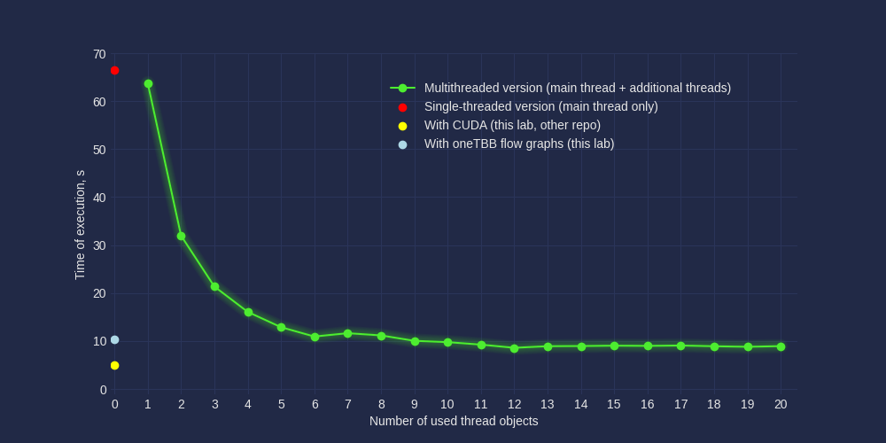

# Lab work 2: Parallelization of evaluation of integral of a given function using oneAPI TBB flow graphs
Author: <a href="https://github.com/bogdanmagometa">Bohdan Mahometa</a><br>
Variant: 4 (Langermann function)

## Prerequisites

The following tools need to be available in order to use the project:
- GCC
- Cmake and Make
- Boost library (Boost::program_options Boost::system are used in the project)
- oneAPI TBB
- Python 3 (if you want to use scripts)
- `numpy`, `matplotlib` and `mplcyberpunk` Python packages if you want to run `plotter.py`

### Compilation

In order to get an executable of the program calculating integral, execute the following in the 
project's root directory.
```bash
$ ./compile.sh -d -O -R
```

### Usage

#### Running the compiled program once

To execute the compiled program once, run the following command in the project's root
directory:
```bash
$ ./bin/integrate_task_4 <path-to-configuration-file>
4
-1.60464695758
2.94818379043e-07
1.83727843363e-07
12221227
```
Argument ```<path-to-configuration-file>``` is optional (defaults to ./data/config_file.cfg).

The content of ```<path-to-configuration-file>``` should be in TOML format with exactly the following
set of specified arguments:
- abs_err - desired absolute error
- rel_err - desired relative error
- x_start - left bound of integration along x axis
- x_end - right bound of integration along x axis
- y_start - lower bound of integration along y axis
- y_end - upper bound of integration along y axis
- init_steps_x - number of point in initial partition along x axis
- init_steps_y - number of point in initial partition along y axis
- max_iter - maximum number of iterations

See example of configuration file in ```data/``` directory

The program outputs the following information in the following order:
- number of variant (4)
- calculated value of integral
- absolute error (isn't real absolute value, only estimation)
- relative error (isn't real relative value, only estimation)
- time spent calculating the integral (in microseconds)

#### Running the program several times
You can run the executable several times and find minimum time of execution among all runs. To this end,
run the following in the project's root directory:
```bash
$ python3 runner.py <number-of-runs>
13162516
```

The ```runner.py``` script creates temporary configuration file with values specified in the 
source code of ```runner.py``` and passes it to the executable. Path to the
executable is also specified in the source code of ```runner.py```.

The script prints out the minimum execution time among all runs (in microseconds).

### Important!

I used PVS Studio to check for the problems. All warnings that are still found by PVS Studio 
haven't been fixed by me deliberately.

### Results

I ran the executable several times with the following configuration file:
```toml
abs_err = 0.0000005
rel_err = 0.00002
x_start = -10
x_end = 10
y_start = -10
y_end = 10
init_steps_x = 100
init_steps_y = 100
max_iter = 10
```

Among all runs, the minimum execution time was `10258938` seconds.

The following chart compares 
<b style="color: #add8e6;">oneAPI TBB flow graphs impelementation</b> vs
<b style="color: yellow;">CUDA implementation</b> vs
<b style="color: #4cec30;">implementation with thread objects</b> vs
<b style="color: red;">concurrent implementation</b>:




# Additional tasks
